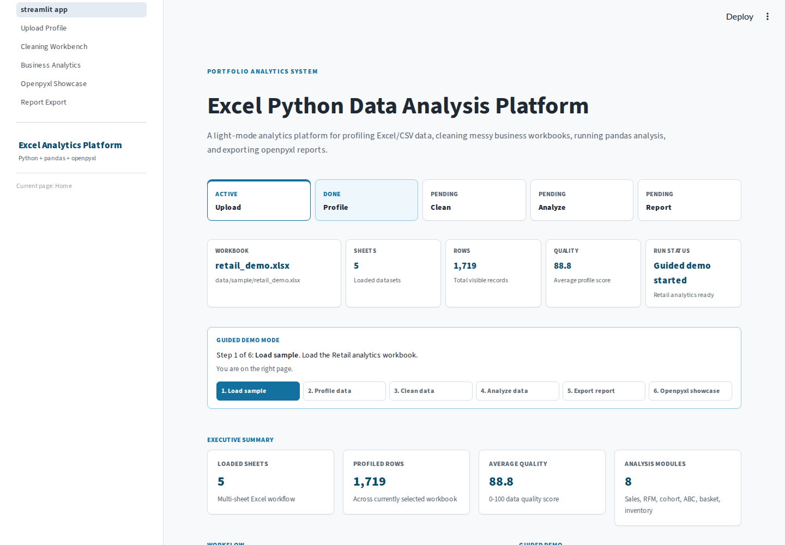
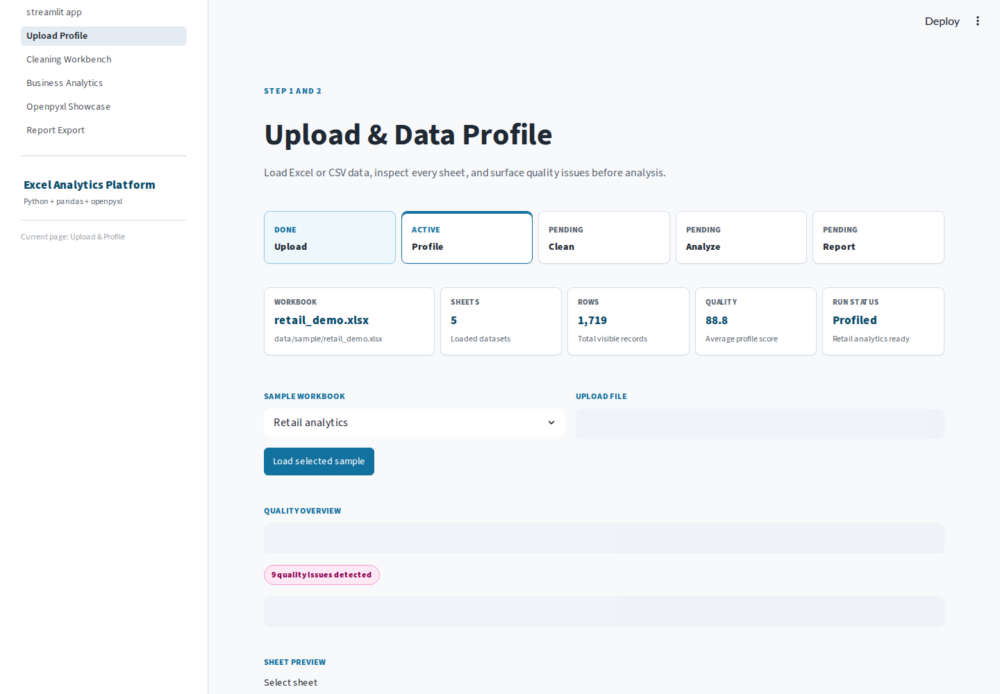
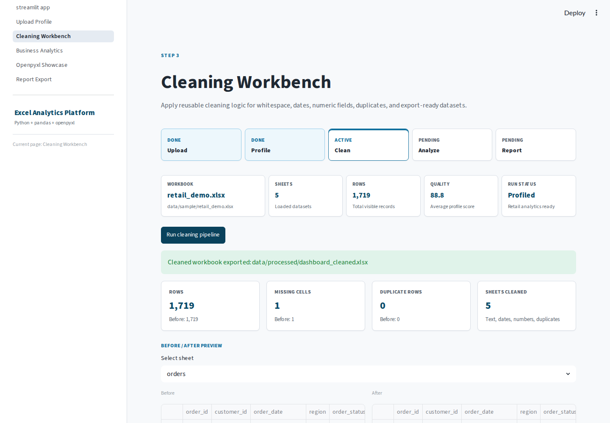
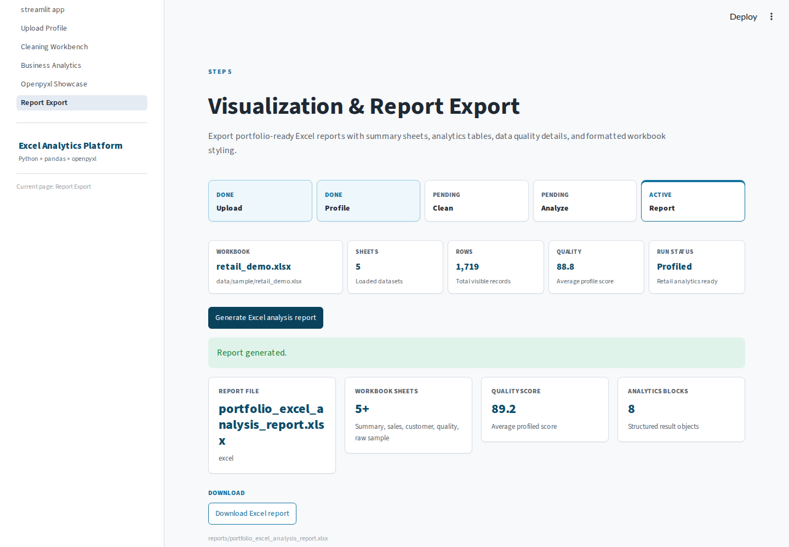
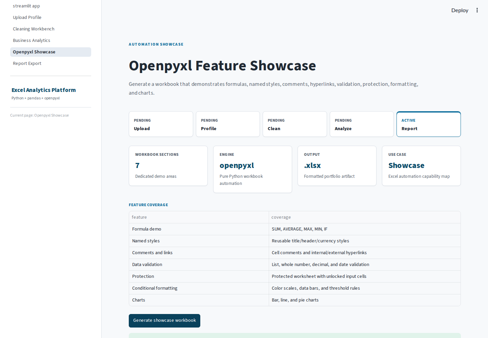
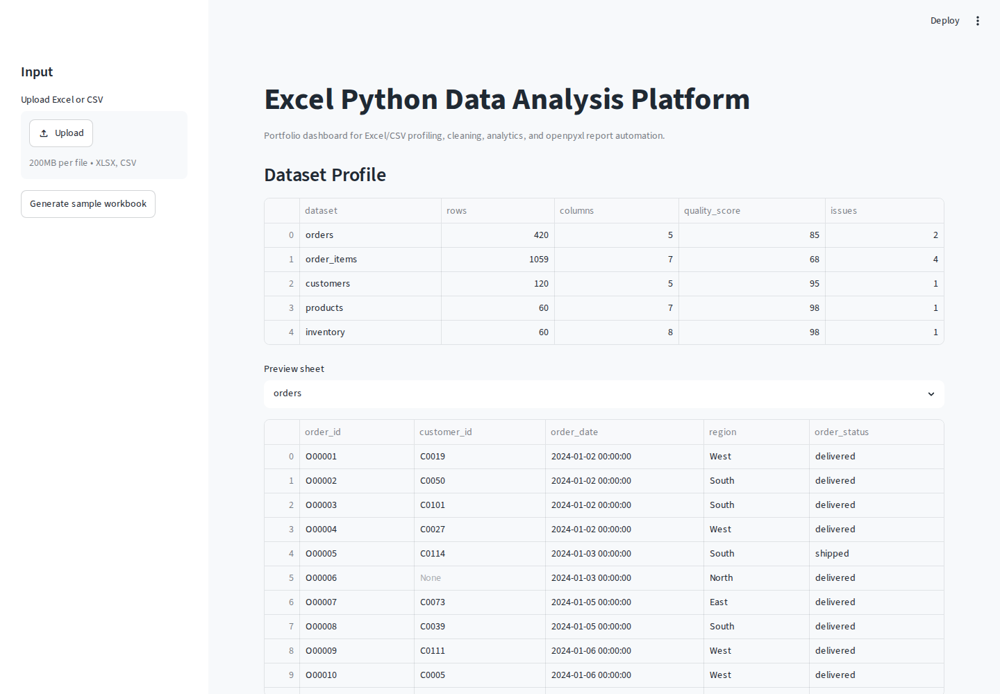
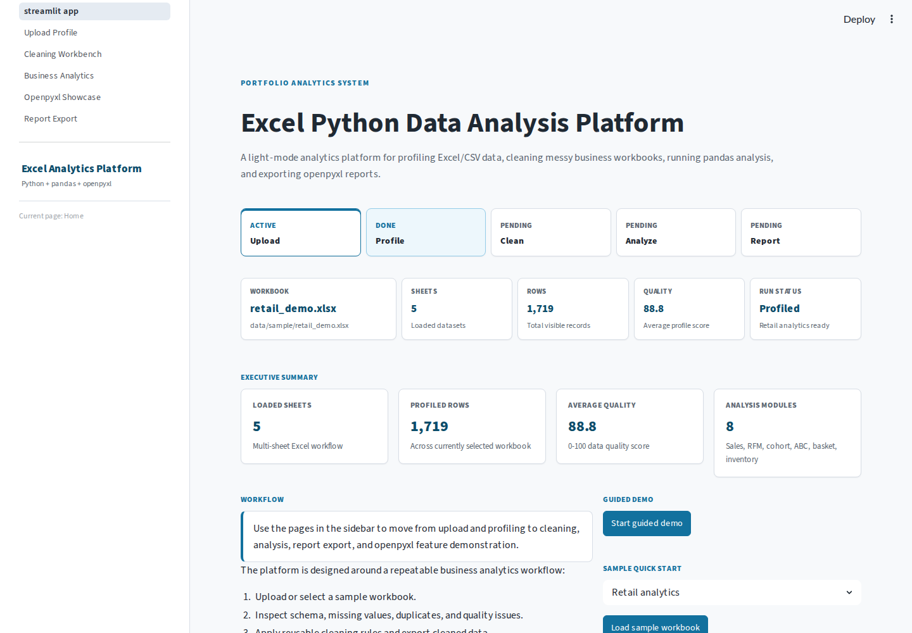
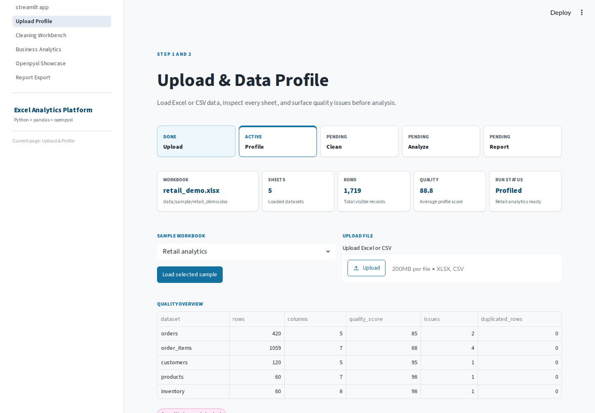
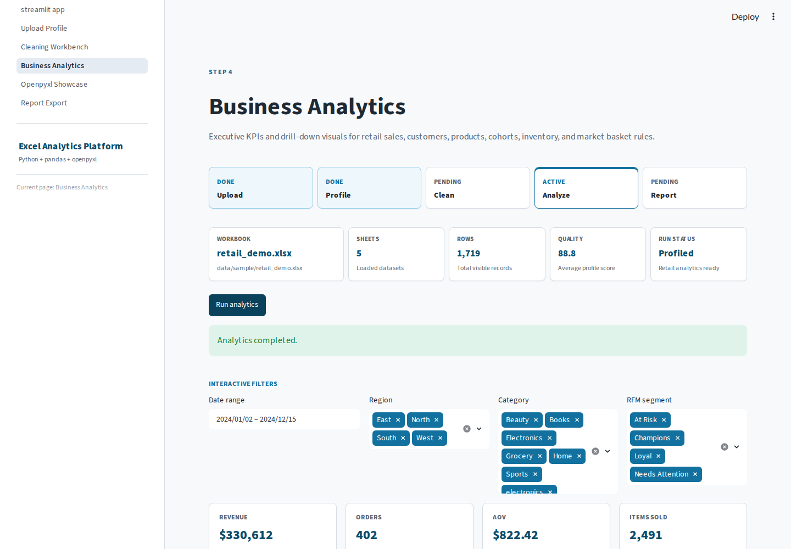
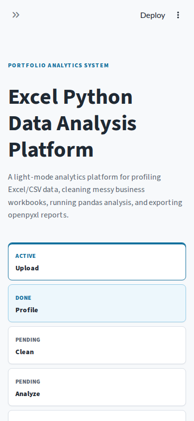

# Excel Python Data Analysis Platform

Portfolio-grade Excel and CSV analytics platform built with Python, pandas, openpyxl, Plotly, and Streamlit.

This project converts messy business workbooks into a complete analysis product: upload, profile, clean, analyze, visualize, and export formatted Excel reports.

## Problem Statement

Business teams often store sales, customer, product, finance, and inventory data in Excel workbooks. Those files usually contain inconsistent categories, missing values, duplicate rows, currency strings, mixed date formats, and scattered sheets. This platform shows how Python can turn that workbook-driven workflow into a repeatable analytics system.

## Platform Workflow


## Features

- Multi-sheet Excel and CSV ingestion.
- Data profiling with schema, missing values, duplicates, suspected field types, and quality issues.
- Cleaning workflow for text normalization, date parsing, numeric conversion, and duplicate removal.
- Business analytics for sales, customers, RFM, cohort retention, inventory, ABC classification, market basket, and time series trends.
- Streamlit multipage dashboard with workflow status, filters, KPI cards, charts, and report downloads.
- openpyxl report automation and feature showcase workbook.
- CLI for sample generation, profiling, cleaning, analysis, report export, and openpyxl showcase generation.
- Guided demo mode, Playwright E2E recording, demo video, trace artifacts, and static demo summary.

## Demo

Use the guided demo when presenting this project in a portfolio review or interview.

```bash
streamlit run app/streamlit_app.py
```

Then click `Start guided demo` on the Home page.

For a fully automated demo recording:

```bash
python scripts/run_e2e_demo.py --port 8511 --record
```

For CLI-only artifact generation:

```bash
excel-analysis demo
```

Demo references:

- [Demo walkthrough](DEMO.md)
- [Detailed demo script](docs/demo_script.md)
- [Demo video](assets/demo/demo_walkthrough.mp4)
- [Demo steps GIF](assets/demo/demo_steps.gif)
- `reports/demo_summary.html`

## Demo Evidence

The repository includes a generated walkthrough video, a compact GIF, step-by-step screenshots, and a static HTML summary so reviewers can understand the full demo without manually running the app.

### Walkthrough Video

The committed local video is available at [`assets/demo/demo_walkthrough.mp4`](assets/demo/demo_walkthrough.mp4). GitHub may not render local MP4 files inline in every view, so the GIF and screenshots below provide an immediate preview.

### Quick Preview GIF


### Guided Demo Screenshots

| Step | Evidence |
| --- | --- |
| 1. Home guided demo |  |
| 2. Upload & Profile |  |
| 3. Cleaning Workbench |  |
| 4. Business Analytics |  |
| 5. Report Export |  |
| 6. Openpyxl Showcase |  |

### Static Demo Summary

Open [`reports/demo_summary.html`](reports/demo_summary.html) to inspect a static snapshot with KPI summary, dataset profile, generated artifacts, and dashboard screenshots.

## Dashboard Design

The dashboard uses a light analytics interface inspired by professional data products such as Geckoboard, Tableau Public, Urban Institute data visualizations, and Berkeley data visualization guidance.

- Light workspace: `#F7F9FB` background, `#FFFFFF` surfaces, subtle borders, and restrained card shadows.
- Main chart color: Urban blue `#1696D2`.
- Accessible interaction color: `#12719E`, selected because white text on `#1696D2` does not meet WCAG AA for normal text.
- Accent colors: `#FDBF11` for highlights and `#EC008B` for warning or high-priority emphasis.
- Typography: Lato / Arial / sans-serif with practical sizes for titles, labels, body text, tables, and captions.
- Numeric UI: tabular numeric rendering for KPI cards and metric-heavy tables.

## Dashboard Pages

- Home: executive summary, dataset status, and sample quick start.
- Upload & Profile: sample workbook selection, file upload, quality summary, issue table, and sheet preview.
- Cleaning Workbench: before/after cleaning summary, preview, next action guidance, and cleaned workbook download.
- Business Analytics: interactive filters, KPI cards, revenue trend, region/product rankings, RFM summary, cohort size, ABC, and market basket threshold sliders.
- Openpyxl Showcase: formulas, named styles, comments, hyperlinks, data validation, sheet protection, conditional formatting, and charts.
- Report Export: portfolio Excel report generation and download.

## Before vs After

| Before: single-page demo | After: product dashboard |
| --- | --- |
|  |  |

| Upload & Profile | Business Analytics |
| --- | --- |
|  |  |

| Report Export | Mobile Layout |
| --- | --- |
|  |  |

## Business Value

| Module | Business value |
| --- | --- |
| Profiling | Finds schema, missing value, duplicate, and quality issues before analysis starts. |
| Cleaning | Converts messy Excel fields into analysis-ready data with repeatable rules. |
| Sales analysis | Measures revenue, orders, AOV, region performance, product ranking, and trends. |
| Customer analysis | Identifies customer value, purchase behavior, and repeat activity. |
| RFM segmentation | Groups customers into actionable lifecycle segments. |
| Cohort retention | Shows whether newly acquired customers return over time. |
| ABC inventory | Classifies products by revenue concentration for inventory prioritization. |
| Market basket | Finds product pair associations for bundling and recommendation ideas. |
| Excel reporting | Produces formatted workbook artifacts that business users can inspect and share. |

## Technical Highlights

| Area | Techniques demonstrated |
| --- | --- |
| Excel Automation | openpyxl formulas, named styles, charts, data validation, protection, comments, hyperlinks, conditional formatting |
| Pandas Analytics | groupby, merge, resampling, RFM, cohort retention, ABC classification, market basket metrics |
| Data Engineering | multi-sheet ingestion, profiling, quality checks, reusable cleaning pipeline |
| Dashboard Engineering | Streamlit multipage app, session state, reusable UI components, Plotly charts |
| Testing | unit tests, CLI tests, UI smoke tests, Playwright E2E, video recording, trace artifacts |

## Case Studies

- [Excel Automation](docs/case_study_excel_automation.md)
- [Business Analytics](docs/case_study_business_analytics.md)
- [Data Quality Pipeline](docs/case_study_data_quality_pipeline.md)
- [Dashboard Testing](docs/case_study_dashboard_testing.md)

## Technical Decisions

- Streamlit is used because the project is an analytics portfolio product, not a consumer web app.
- Business logic lives in `src/excel_analysis`; Streamlit pages only orchestrate UI and user interaction.
- openpyxl is used for workbook formatting, formulas, validation, comments, protection, charts, and report automation.
- Plotly is used for interactive dashboard charts with a consistent light theme.
- Synthetic sample workbooks are included so the project can run without external private datasets.

## Quick Start

```bash
python -m pip install -r requirements.txt
excel-analysis generate-sample --case all
streamlit run app/streamlit_app.py
```

Open the local Streamlit URL and use the sidebar pages to move through the workflow.

## CLI

```bash
excel-analysis generate-sample --case all
excel-analysis profile --input data/sample/retail_demo.xlsx
excel-analysis clean --input data/sample/messy_sales.xlsx --output data/processed/cleaned_messy_sales.xlsx
excel-analysis analyze --input data/sample/retail_demo.xlsx
excel-analysis export-report --input data/sample/retail_demo.xlsx
excel-analysis showcase-openpyxl
```

## Testing

```bash
python -m compileall src app tests scripts
pytest -q
python scripts/verify_ui.py --port 8510 --update-screenshots
python scripts/run_e2e_demo.py --port 8511 --record
pytest tests/e2e -q
```

The test suite covers IO, cleaning, analytics, report generation, sample workbook generation, openpyxl showcase generation, CLI smoke behavior, UI design tokens, screenshot assets, and Streamlit UI verification.

## Architecture

```text
app/
  streamlit_app.py
  pages/
  styles/
  ui/
src/excel_analysis/
  analytics/
  cleaning/
  data/
  io/
  profiling/
  reporting/
  services/
  schemas/
tests/
scripts/
data/sample/
reports/
```

## Resume Highlights

- Built an Excel-to-Python analytics platform that automates data profiling, cleaning, business analysis, dashboard visualization, and Excel report generation.
- Implemented reusable pandas modules for RFM segmentation, cohort retention, ABC inventory classification, market basket analysis, and time series baselines.
- Designed a Streamlit multipage dashboard with workflow status, interactive filters, KPI summaries, quality reporting, and downloadable openpyxl reports.
- Created synthetic business workbooks for retail, messy sales, finance, inventory planning, and customer segmentation scenarios.
